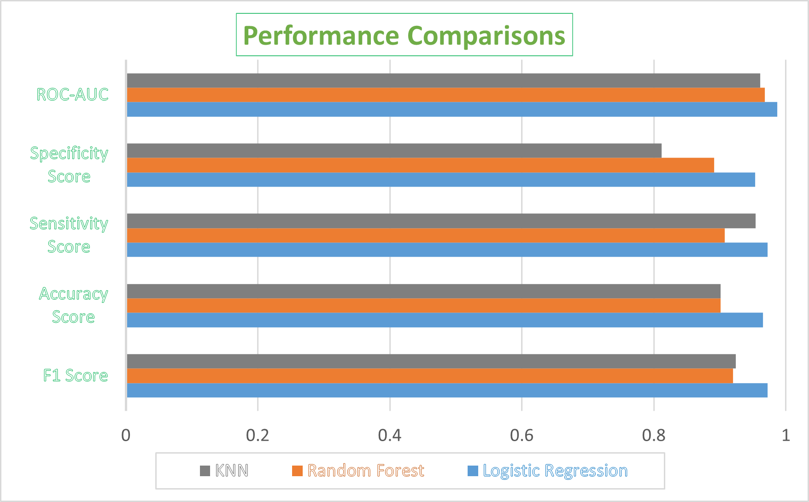
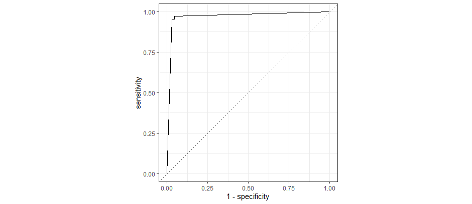
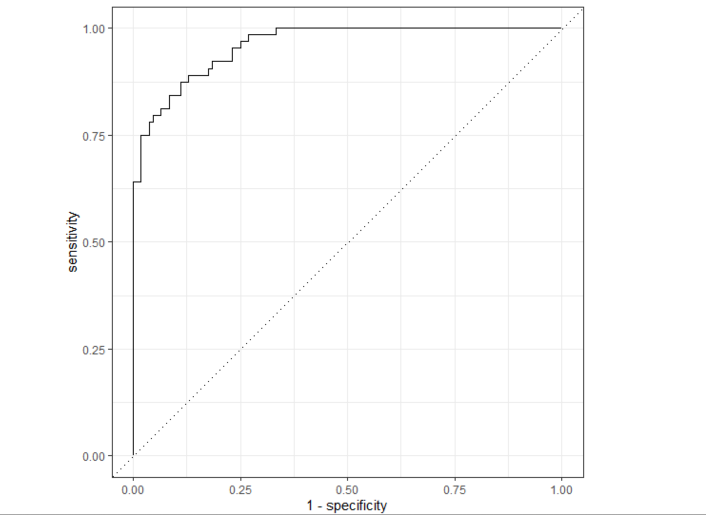
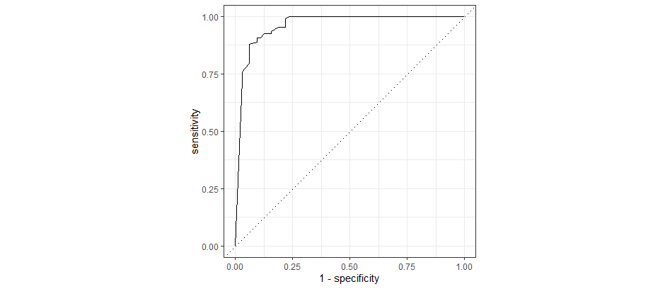
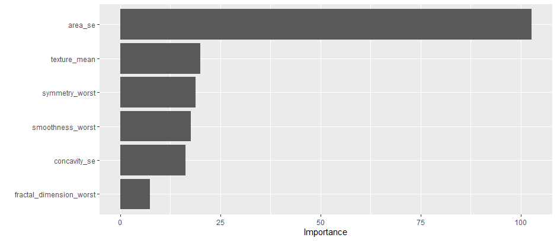

# Introduction
Breast cancer is the most diagnosed type of cancer in women in the United States. Although it affects men as well, the majority of the cases are reported from women. Globally, about 1 in every 8 women will have a very high probability of developing breast cancer at some stage in their lifetime. The type of breast cancer is determined by the specific cell affected. Most breast cancers are carcinomas which means that they originate  from the epithelial cell. While the rare sarcomas (occuring in <1%) start from the stromal cells of the breast. From published literature, machine learning methods such as random forest classifier has aided breast cancer diagnosing and prognosticating. Also other traditional machine learning methods that are focused on tree-based techniques have been extensively used in research in detecting breast malignancy.
The prime objective of the research was to develop a Machine Learning model that predicts whether a cell is malignant or benign based on the various characteristics of the cell nuclei. The study was aimed at analyzing the 32 attributes part of the Wisconsin breast cancer research dataset in order to choose a subset of attributes that gives the best model performance in terms of predicting the response variable which is the diagnosis column. Furthermore, another key goal of study was to create visuals to display the results in a presentable manner. The visuals were expected to present performance metrics for each of the models executed. 

# Methods
## a. Data source
The data set is taken from the Wisconsin diagnostic breast cancer research database, collected by Dr. William H Wolberg, University Of Wisconsin Hospitals, Madison. 
## b. Data preprocessing
The data was checked for any of the missing values. Fortunately, the dataset did not have any kind of missing values, so no treatment was needed in this regard. We then had to binarize and convert the response variable into a factor. 
##  c. Feature selection process
The first step of the feature selection process was to check for statistically significant variables. In order to achieve this, we started off by implementing logistic regression models with ‘Diagnosis’ as the response variable and each of the other variables part of the dataset as the predictor variables. We ended up producing 31 independent logistic regression models. A variable was considered statistically significant if its model with the response variable showcased a p value of less than 0.05. Any of the models exhibiting p value greater than the 0.05  indicated that the variable involved did not hold any predictive value and was hence statistically insignificant. This process helped us eliminate 7 statistically insignificant variables. The variables were removed from the dataset and the later part of the analysis was performed on the modified dataset. 
## d.	Description of dependent and independent variables
‘Diagnosis’ Column was the variable of interest and hence served as the dependent/response variable. The column indicated whether a cell was diagnosed as either Malignant - affected by cancer or Benign - unaffected by cancer. The dataset comprises ten real-valued features that were determined for each cell nuclei. The features include cell radius, texture, perimeter, area, smoothness, compactness, concavity, concave points, symmetry, and fractal dimension. Furthermore, the mean, standard error, and the largest(mean of the three largest values) were computed for each of the features for all of the images, making it a total of 31 independent/predictor variables. 

# Results and Discussion

Horizontal Bar chart summarizing performance metrics for each of the models 

ROC curve for the logistic regression model 

ROC curve for the Random Forest model 

ROC curve for the KNN model 

Horizontal bar chart showing top five most important variable determined by the Random Forest Model

## a. Description of key results
According to Table, Logistic regression outperformed every other model as per the F1 score. The model generated an F1 score of 0.972 where 1.000 represents the maximum score any model could attain. K nearest neighbors  and Random Forest model were ranked 2nd and 3rd with F1 scores of 0.924 and 0.920 respectively. Similarly the logistic regression model produced the best accuracy, sensitivity, specificity and area under the Roc curve scores of 0.965, 0.972, 0.953 and 0.987 respectively. Sensitivity score ranked KNN significantly higher than the Random Forest model with the score of 0.954 over 0.907 given to the Random Forest model. There was a tie for second place for the accuracy score as both the KNN and Random Forest models achieved scores of 0.901. Specificity scores reflected that Random Forest model significantly outperformed KNN with the score of 0.891 in comparison to the 0.812 achieved by the KNN model. Although area under the roc curve ranked both the Random Forest and the KNN models very similarly, the Random Forest gave out slightly better results with the score of 0.968 as compared to 0.961 achieved by the KNN.
Logistic regression model performed above par at all the classification thresholds. The graph represents True Positive/sensitivity (The values from the positive class that the model was able to correctly predict) on the y-axis while False Positive/1-Specificity (The values from the positive class the model wrongly predicted) on the x-axis. The dotted line dissecting the plot diagonally is known as the 50% line i.e if the model generated that result it would be getting only half of its predictions correct. Any model that produces an roc curve below that line would be performing at less than the 50% performance indicator. Ideally, the closer the roc curve is to the top left corner of the chart, the better the model performs. The curve generated by the logistic regression model is very close to the ideal threshold and hence this should be considered the visual depiction of why the model was able to outperform the rest of the models implemented as a part of the research.  The ROC Curve for the KNN model did showcase decent performance too as its roc curve does try to get closer to the ideal mark. Random Forest has the roc curve that is furthest from the top left corner as can be seen in the image which explains part of the reason why it performed slightly below par in comparison to the other models tested. 
The last bar chart showcases top attributes based on the Random Forest’s built-in feature ranking algorithm. The ranking is based on the principles of gini importance or the mean decrease in impunity. The algorithm indicated area_se, texture_mean, symmetry_worst, smoothness_worst, concavity_se and fractual_dimension_worst as the most important factors/features when it came to predicting the probability of a breast cell being classified Malignant or Benign with cancer. 

## b. Discussion of result implications
Our results demonstrate that the data mining techniques we employed effectively detected higher accuracy. The determined outcomes depict the competence of our prediction models and prove that the model selection process went well. The logistic regression model proved to be the best of the three models since it outperformed the other models in every performance metric that we measured. One example of the logistic regression model outperforming the other models is when it secured the highest accuracy score with a 96.50% accuracy, while the Random Forest and the K Nearest Neighbors (KNN) models both performed with an accuracy score of 90.1%. Because of our favorable results we are able to deduce that our prediction models are capable of detecting breast cancer diagnosis while also providing favorable results within a shorter time in regards to training the model. It is techniques, models, and results like this which will allow patient care providers and data analysts to apply better classifiers for diagnosing breast cancer features. 

## c.	Strengths, limitations, and future work
One of the strengths of our study was that our models proved incredibly accurate. These predictive models would assist analysts in detecting the cancerous mass by analyzing cancerous patient data. Another strength of this study was that our dataset did not contain missing values which allowed for a proper construction of our models, that allowed them to train better and generate great results. One of the limitations of our chosen dataset was the limited number of instances/rows. Additionally, the data set was imbalanced (357 malignant cases and 212 benign cases). We had 569 rows and our study definitely could have benefited from a larger dataset with more entries, as it would only add to the credibility and authority of our report. This improvement would ultimately have to be performed by focusing on dimensionality, to reduce the amount of variables which in turn would directly increase the number of available rows in our dataset. In regards to future work, we would try testing additional classification algorithms to further understand and compare results in order to enhance the scope of our project. As data relating to breast cancer datasets become more available, we would aim to use deep learning models to detect breast cancer with new data augmentation strategies and data exploratory techniques to handle the data scarcity and diversity. Gathering similar breast cancer datasets from other countries could prove to be an amazing avenue for future work, as it may allow us to uncover new insights by evaluating algorithms and results in comparison. We would want to figure out whether the experiments on the datasets and patient data from other countries affect our models’ performance. Since our dataset only examines American patients, the results may or may not be congruent or as effective with data from Asian patients for example.

# Conclusions
This study identifies the Logistic Regression model to be most successful in breast cancer classification. (96.5% accuracy rate, and the least number of fault predictions). Area_se turned out to be the most important variable for classifying breast cancer outcomes. This was due to our Random Forest Model ranking and determining the most important variables in Fig. 3.2. The overall findings of our report demonstrate that machine learning systems can accurately categorize breast cancer outcomes and pinpoint important traits even for limited datasets. This should potentially extrapolate if given larger datasets. There is a significant potential in data mining techniques in accurately timing the diagnosis of cancers. Accurate and timely diagnosis of various neoplastic diseases i.e breast cancer, is still a major problem for proper treatment in the healthcare field. The precise analysis of cancer features is a time-consuming and challenging task due to the availability of massive data and the lack of DM techniques with appropriate ML classifiers.

