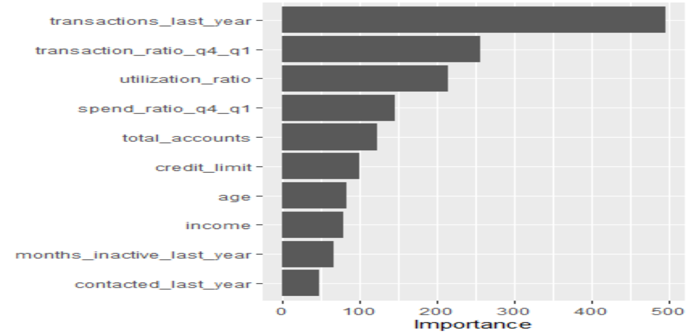
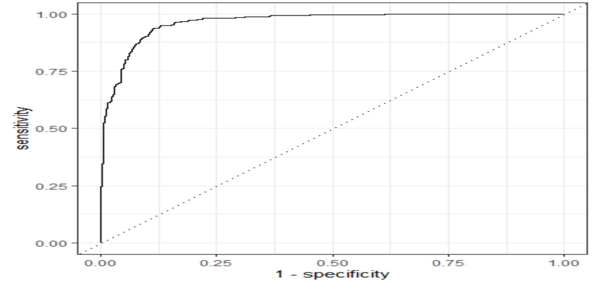

# Muhammads_portfolio
Analytics Portfolio

# [Auto Claims Exploratory Data Analysis](https://github.com/mbilal3/Muhammads_portfolio/tree/main/Auto_Claim_Analysis)

The goal of the project was to perform an explanatory data analysis using R on data set of the auto claims filed by customers of the automobile insurance company in order to identify the factors impacting the profitability of the company. The prime objective of the analysis was to look into the segments of the company’s most and the least profitable customers for any clear patterns and indications which could potentially help the company minimize losses which in turn would increase the revenues. A set of 8 questions was designed and answered so as to maximize the value of the insights extracted. The questions explored how customer demography, channel of sales used to onboard the customer, customer’s class of vehicle and customer gender impacted the revenue generated. The questions also investigated the influence of insurance policy and coverage type on the net revenue of the company. The following images provide a snipet of the key findings. 

< br/> 

< br/> 

< br/> 

# [Machine Learning Driven Customer Churn Analysis on Credit Card Data](https://github.com/mbilal3/Muhammads_portfolio/tree/main/Machine_Learning_Driven_Customer_Churn_Analysis)
The goal of the project was to perform an explanatory analysis followed by a predictive data analysis on data set of credit card accounts of a large U.S. bank in order to determine factors impacting customers cancelling their credit card accounts. The second part of the project comprised of data based informed predictions with the employment of Machine Learning algorithms in order to determine whether a customer will cancel their account in the future. The bank has seen a record number of people cancel their credit accounts which in turn is triggering a huge decline in their revenues. The bank is focused upon retaining maximum number of customers on credit accounts in order to improve their revenues. An in-depth knowledge of factors influencing customer decisions would greatly help the bank improve their procedures and provide targeted incentives to the customers which could prove to be of great value to the organization. A set of 5 questions was designed and answered so as to maximize the value of the insights extracted. The questions explored how customer income, card type, customer’s account spending, Q4 to Q1 transaction ratio and card utilization impacted their decision on whether to discontinue credit accounts. The questions also investigated how customer's contact with the sales representatives impacted their decision on whether to retain the services or cancel the account.
< br/> 

Top 10 highly important predictor variables extracted using the importance scores of the Random Forest model 

Graph displaying the ROC_AUC Curve for the Random Forest model. The AUC value of 0.96 indicates that the model is highly reliable and hence was the best performing on this dataset 

