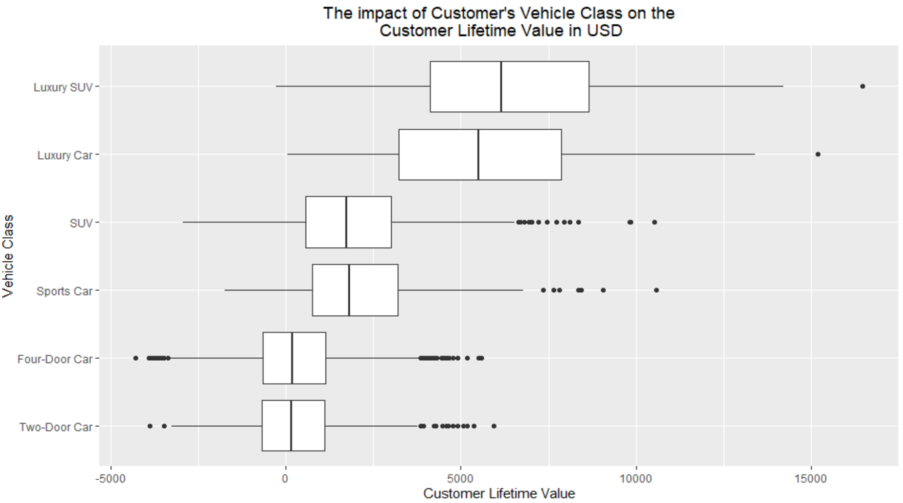
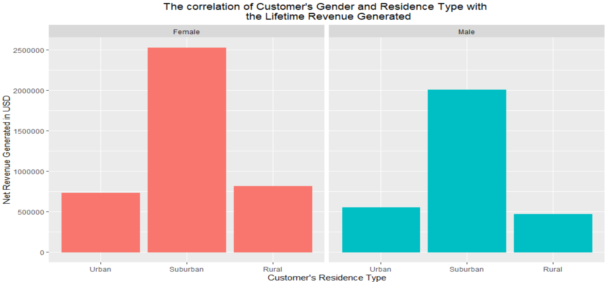

# Muhammads_portfolio
Analytics Portfolio

# [Auto Claims Exploratory Data Analysis](https://github.com/mbilal3/Muhammads_portfolio/blob/main/Insurace%20Claims%20Analysis.rmd)

The goal of the project was to perform an explanatory data analysis using R on data set of the auto claims filed by customers of the automobile insurance company in order to identify the factors impacting the profitability of the company. The prime objective of the analysis was to look into the segments of the company’s most and the least profitable customers for any clear patterns and indications which could potentially help the company minimize losses which in turn would increase the revenues. A set of 8 questions was designed and answered so as to maximize the value of the insights extracted. The questions explored how customer demography, channel of sales used to onboard the customer, customer’s class of vehicle and customer gender impacted the revenue generated. The questions also investigated the influence of insurance policy and coverage type on the net revenue of the company. 

